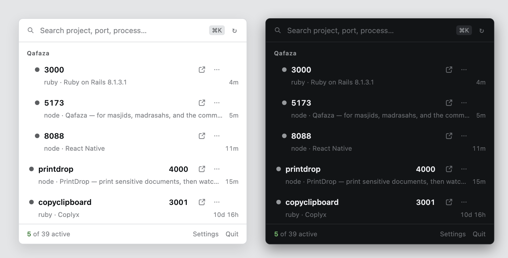

<div align="center">


# Portly

**Which of your local projects is running on which port.**

A macOS menu-bar app. No Dock icon, no window — just the list, one keystroke away.



</div>

---

## The problem

You have eight things running and no idea which is which. `lsof -i :3000` tells you
a PID and a process name — `node`, `ruby`, `node` again — which is exactly the
information you already had. What you wanted to know is *whose* server it is.

Portly answers that. It resolves every listener to the git repository it is running
out of, groups the ports by project, and lets you open, stop, or restart any of
them without leaving the menu bar.

## What it does

- **Names things properly.** A listener is identified by its git repo, not its
  working directory. Three Rails apps all running out of `backend/` no longer look
  identical.
- **Groups by project.** A monorepo on 3000, 5173 and 8088 reads as one project
  with three ports, not three unrelated rows. Single-port projects get no group
  chrome at all.
- **Hides the noise.** On a real machine, non-HTTP daemons outnumber dev servers
  about four to one. They are hidden by default; the footer reads `8 of 39 active`
  and one click reveals the rest.
- **Opens in a browser** — the primary action, always visible, one click.
- **Stops a server** with an inline confirm that names the project and port.
- **Starts it again**, from the command Portly recorded when it stopped it, or from
  the command the project declares. See [Stop and Start](#stop-and-start).
- **Reads at a glance.** Protocol is encoded in *shape*, not colour — filled dot,
  ringed dot, outline square, dashed ring — so the list survives grayscale and
  colour-blindness.
- **Keyboard first.** `⌘K` search, `↑↓` to move, `⏎` to open, `⌫` twice to stop,
  `Esc` to back out.

## Install

Requires **Node 20+** and macOS.

```sh
git clone <your-repo-url> portly
cd portly
npm install
npm start
```

The tray icon appears in the menu bar. Click it to open the popover.

> [!NOTE]
> **If `npm start` reports "Electron failed to install correctly"**, run
> `npm run fix:electron`. Electron's postinstall uses `extract-zip`, which fails
> silently on some macOS setups, leaving a partial `dist/` and no `path.txt`. The
> downloaded archive in the cache is intact, so the script re-extracts it with the
> system `unzip`.

## Platform support

**macOS only, in practice.** Port scanning uses `lsof` and `ps`, the popover
positions itself against the menu-bar item, and the icon pipeline calls `iconutil`.
There is a monochrome tray glyph for Windows and Linux, but nothing else has been
built or tested there. Issues for other platforms are out of scope until someone
ports the scanner.

## How it finds things

| | |
| --- | --- |
| **Listeners** | `lsof -nP -iTCP -sTCP:LISTEN -FpcnL`, field-mode output, collapsed by `port + pid` — lsof reports each listener once per address family. |
| **Uptime and argv** | One `ps -o pid=,etime=,command=` call. A second `ps -o comm=` call gets the untruncated executable name, because lsof's own command field cuts off at ~31 characters. |
| **Protocol** | Known service ports and process names short-circuit; everything else gets a real HTTP request, then HTTPS, **on the addresses lsof reported**. Vite binds IPv6 localhost by default, so probing only `127.0.0.1` misreports it as non-HTTP. |
| **Page title** | `<title>` from the response, entities decoded. Titles from 4xx/5xx responses are discarded — "404 Not Found" is noise. |

Protocol results are cached per `port:pid`, titles for 30 seconds. A cold scan of
~40 listeners takes about 1.6s; warm scans about 150ms. Portly polls every 5s while
the popover is open and every 30s while it is closed.

### Project names

The working directory is not a project identity. Resolution order:

1. **The git repository root**, not the cwd. `Desktop/Qafaza/web` → `Qafaza`.
2. **System trees are rejected.** `/opt/homebrew` is itself a git repo, so postgres
   running out of `/opt/homebrew/var/postgresql@18` would otherwise resolve to
   "homebrew".
3. **Generic names gain their parent.** `backend`, `frontend`, `api`, `web`, `dist`
   and friends become `coplyx/backend`.
4. **Collisions extend leftward.** Two different directories producing the same
   label both grow a segment until they differ: `x/proj/api` vs `y/proj/api`.

Grouping keys on the project's **absolute path**, never the display name — names
can collide, paths cannot.

## Stop and Start

**Stop** is revealed on hover or keyboard focus, never at rest, because it is
destructive. It confirms inline, reading `Stop printdrop on 4000?` — project and
port, not PID, because the port is what you are verifying. The destructive action
comes first, `Esc` cancels, and the row does not change height. `SIGTERM` first,
`SIGKILL` only if the process is still alive after 1.5 seconds.

**A stopped row keeps its place.** It stays exactly where it was, in its group,
dimmed, with its port struck through and its uptime replaced by `stopped 12s ago`.
It does not move, collapse, or animate away, and after ten minutes it disappears
outright. A row you just acted on must not leave your field of view.

**Start** re-runs the command Portly resolved when it stopped the server, from one
of two sources.

**1. Captured argv** — ground truth, read from the live process. Portly walks up
from the listening PID to the highest ancestor still rooted in the same directory
and captures *that* command. `npm run dev` spawns `sh -c`, which spawns `node`;
capturing the child would give you `node server.js`, orphaned from npm. The walk
steps *through* `-c` wrapper shells without ever capturing one, and stops at an
interactive shell, a supervisor, PID 1, or the first ancestor that left the
directory.

**2. Inferred from the project** — for servers that overwrite their own argv. Rails,
puma, unicorn and postgres replace it with a status line, so `ps` reports
`puma 7.2.0 (tcp://0.0.0.0:3000) [backend]` and the real arguments are gone from
memory, unrecoverable by any means. But the command is not unknown: the project
declares it.

| marker in the listener's directory | inferred command |
| --- | --- |
| `bin/rails` + `config.ru` | `bin/rails server -p <port>` |
| `manage.py` | `python manage.py runserver <port>` |
| `mix.exs` | `PORT=<port> mix phx.server` |
| `Procfile.dev` / `Procfile` `web:` line | that line, with `$PORT` bound |
| `package.json` `scripts.dev` / `scripts.start` | `npm run dev` / `npm start` |

Inference requires a marker file and searches the listener's own directory before
the repo root, so a monorepo resolves to the specific app. Hovering a stopped row
always shows the exact command and where it came from — `captured argv` or
`inferred from Rails binstub + config.ru` — and the ⋯ menu has **Copy start
command**.

Re-spawning goes through your login shell (`$SHELL -l -c`) so `nvm`, `pyenv` and
`rbenv` shims are on `PATH`; Electron's own environment would pick the wrong
runtime or none. The child is detached with output redirected to
`logs/start-<port>.log`, so it outlives Portly.

### What Start cannot do

Read this before relying on it.

- **It will not restart anything Portly did not stop.** A process that exited on its
  own, crashed, or was killed from a terminal gets no Start action at all — not a
  disabled one. It may have died for a reason you have not seen, and you did not ask
  Portly to touch it.
- **An inferred command is a reconstruction, not a recording.** It is what the
  project says starts a server on that port, which is not necessarily the command
  *you* ran. If you start Rails via `bin/dev` alongside a CSS watcher and a job
  runner, Start gives you the plain web process only. Hover the row to see exactly
  what will run.
- **A captured command can be stale.** It is a string recorded up to 7 days ago.
  Rename the script, move the directory, or switch branches and it will run the old
  command or fail. A missing working directory is caught before spawning; nothing
  else is.
- **Your shell profile can still break it.** `$SHELL -l -c` is close to a fresh
  login shell but not identical to your terminal. Anything exported only from an
  interactive path — direnv, a manual `nvm use`, a `.zshrc` guarded on `$-` — will
  not be present. The usual symptom is `command not found`.
- **Success means a listener appeared within 10 seconds**, not that the app is
  healthy. A server that binds the port and then fails to compile counts as started.
- **Failures are loud, and never retried.** Non-zero exit within 3s, or no listener
  within 10s, returns the row to its stopped state and puts the captured stderr on
  the row's tooltip and in its ⋯ menu.

## Design notes

The interface borrows from macOS system UI rather than the dark-dashboard default
most dev tools reach for. A menu-bar popover is a glance, not a dashboard.

- **One accent hue**, used only for focus rings and the active count. Never for
  protocol or liveness — those are shape-coded so meaning survives grayscale.
- **Actions are persistently visible**, in a fixed 76px rail that is always
  reserved, so nothing reflows on hover. Open-in-browser *is* the product; hiding it
  behind a hover cost a hunt on every single use. Stop is the exception — it is
  destructive, so it appears only on hover or focus.
- **Tabular numerals** on every numeric field, so ports and uptimes lock into a
  column you can scan without reading.
- **The tray mark** is a square enclosure broken by an aperture on the right edge.
  The aperture is 22% of the height — measured, not guessed: past roughly a quarter,
  the form stops reading as a broken rectangle and closes into a letter C.
  `mockups/tray-candidates.png` shows the ladder at true 16px.

Icons are committed assets, not build output. Regenerate with `npm run icons`
(rasterised through Chromium, so the gradient and shadow come from the same engine
that drew the review sheet).

## Development

```sh
npm run dev            # Vite HMR for the renderer + esbuild watch for main
npm run typecheck      # renderer and main, strict
npm run build          # bundle main, preload and renderer
npm run icons          # regenerate every icon asset from shared/marks.ts
npm run mockup         # render mockups/portly-states.png
npm run hero           # render mockups/hero.png
npm run tray:compare   # render the 16px tray verification sheet
```

### Layout

```
electron/
  main.ts      Tray, popover window, positioning, IPC, Settings menu
  ports.ts     lsof scanning, protocol probing, stop, stopped-row state
  project.ts   project-name resolution (git root, generic, uniqueness)
  restart.ts   argv capture via ancestor walk, persistence, spawn
  infer.ts     start-command inference from project config
  exec.ts      shared lsof/ps/git helpers
  preload.ts   contextBridge surface (contextIsolation on, sandbox on)
shared/
  types.ts     types shared by main and renderer
  marks.ts     tray mark geometry — one source for artwork and rasteriser
src/
  Popover.tsx  search, grouping, states, keyboard, reconciliation
  Row.tsx      row anatomy, glyphs, action rail, confirm, stopped state
  icons.tsx    the matched icon set, one 16px grid, 1.5px strokes
  tokens.css   oklch ramps, radii, spacing — light and dark
  app.css      component styles
scripts/
  icons.ts          every icon asset, rasterised through Chromium
  capture.cjs       offscreen render → mockups/*.png
  build-electron.mjs · dev.mjs · fix-electron.mjs
```

The renderer opens in a plain browser too — without the Electron preload it falls
back to `src/mockApi.ts`, seeded from the real listener set on the development
machine. That is what the mockup and hero images render, so a design review always
shows the components that actually ship.

## Contributing

Two conventions worth knowing before opening a PR:

- **Shape, not colour, carries meaning.** Anything that has to be legible must
  survive grayscale.
- **Nothing reflows on hover.** The action rail is always reserved. If a change
  makes a row resize or move when the pointer enters it, that is a bug.

## Credits

The interface was built from a design spec authored in Claude Design; the original
`Portly.dc.html` and `Row.dc.html` canvases are kept in `design/` for reference.

## License

Not yet chosen.
